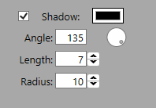

# Shadows
This shadow object contains everything needed to represent an element/text shadow within ProPresenter.


## The `IProElementShadow` Object
The property names are self descriptive, and they match the name of the UI controls within ProPresenter.  For more details about the object on the `color` property, please refer to [the colors docs page](colors.md).

Here is an example shadow object
```javascript
{
  angle: 135,
  color: { r: 0, g: 0, b: 0 }, //black
  enabled: true,
  length: 7,
  radius: 10,
}
```

And here is a screenshot of those values are represented within ProPresenter's UI


